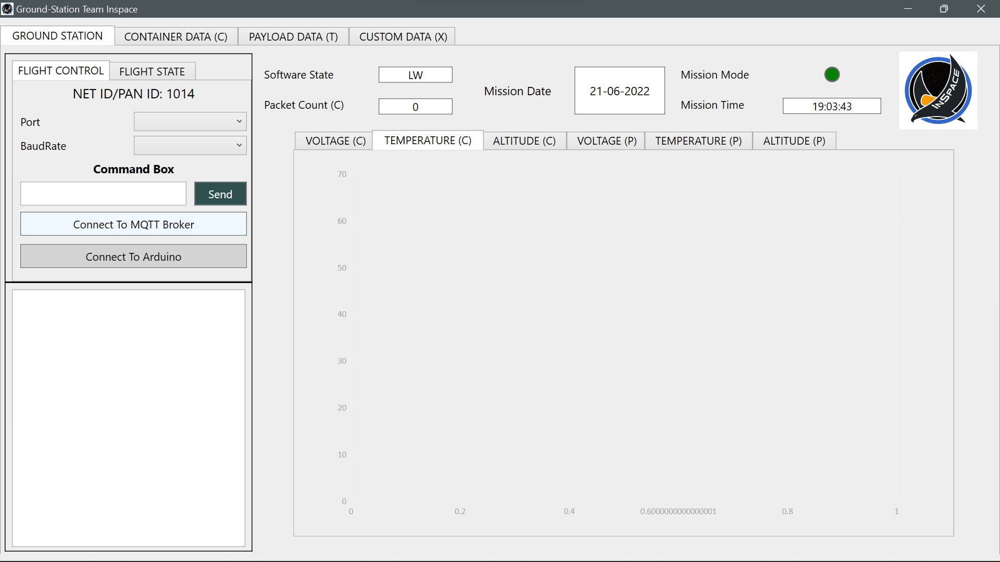

# GCS-Team-Inspace

### Open [GroundStation.sln]([google.com](https://github.com/Ishwarendra/GCS-Team-Inspace/blob/main/GroundStation.sln)) and press F5 to run!

- `Resources Folder contain`:
  - Dummy Graph Images (not used now) and Team LOGO
  - CSVFiles Folder: It contains the csv files for container and payload data

- `MQTTPublisher.cs`: MQTT Publisher Code (MQTTnet Library Used)

- `MainWindow.xaml`: Contains the xaml file for GCS

- `MainWindow.xaml.cs`: Provides various functionalities from behind like plotting graphs in real time, sending and receiving data from serial etc.

### This is how the Software Looks like
___
 

